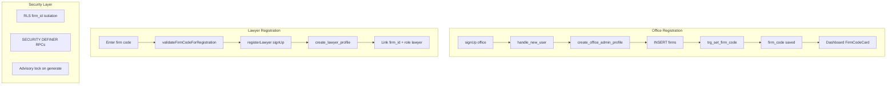

# Firm Code System — Complete Implementation Report

**Project:** LegalMind Yemen  
**Stack:** React + TypeScript + Supabase + PostgreSQL  
**Status:** Production-ready (migrations `007` → `017`)

---

## Executive Summary

LegalMind Yemen uses a **global, human-readable Firm Code** (`ABC-1234`) so law firms can onboard lawyers and assistants securely. Codes are:

- Generated **automatically in PostgreSQL** on firm creation (primary path)
- Optionally generated in **TypeScript** for admin tooling / imports
- Validated on **lawyer registration** before auth signup
- Displayed in the **dashboard** with one-click copy

---

## 1. Firm Code Generation Strategy

| Rule | Implementation |
|------|----------------|
| Format | `PREFIX-NNNN` e.g. `HUD-4829` |
| Prefix | 3 uppercase letters from firm name |
| Suffix | 4 random digits (`0000`–`9999`) |
| Length | 8 characters (within 6–12 requirement) |
| Case | Uppercase only |
| Uniqueness | Global `UNIQUE` index + retry loop |
| Readability | Latin names: first word ≥3 chars; Arabic: keyword map + fallback |

### Examples

| Firm Name | Prefix Logic | Example Code |
|-----------|--------------|--------------|
| Al Huda Law Firm | `HUD` from "Huda" | `HUD-4829` |
| Legal Experts | `LEG` from "Legal" | `LEG-7351` |
| Yemen Justice Office | `YEM` from "Yemen" | `YEM-9248` |
| مكتب العدالة للمحاماة | Arabic keyword `عدال` → `ADL` | `ADL-3104` |

### Concurrency

`pg_advisory_xact_lock(hashtext('legalmind_yemen_firm_code_generation'))` serializes generation within transactions, preventing duplicate codes under concurrent office signups.

---

## 2. Database Schema

### Table: `firms`

```sql
firm_code VARCHAR(12) NOT NULL
CONSTRAINT firms_firm_code_format CHECK (firm_code ~ '^[A-Z]{3}-[0-9]{4}$')
CREATE UNIQUE INDEX firms_firm_code_unique_idx ON firms(firm_code);
CREATE INDEX idx_firms_code ON firms(firm_code);
```

### Migration files (run in order)

| Migration | Purpose |
|-----------|---------|
| `004_auth_redesign_offices_profiles.sql` | Initial `firm_code` column |
| `007_firm_codes.sql` | Functions, trigger, backfill |
| `010_get_office_by_code.sql` | Lookup RPC |
| `013_firm_codes_production.sql` | `search_path`, validation hardening |
| `014_fix_lawyer_registration.sql` | `create_lawyer_profile` |
| `015_fix_rls_grants_permissions.sql` | RLS + EXECUTE grants |
| **`017_firm_codes_consolidated.sql`** | **Arabic prefixes, consolidated grants, lawyer validation** |

---

## 3. PostgreSQL Functions & Trigger

### `firm_code_prefix(firm_name text)`

Derives 3-letter prefix from Latin or Arabic firm names.

### `generate_firm_code(firm_name text)`

1. Computes prefix  
2. Acquires advisory lock  
3. Loops up to 100 attempts: `PREFIX-####`  
4. Returns first unused code  

### `set_firm_code()` — Trigger `trg_set_firm_code`

- **When:** `BEFORE INSERT ON firms`  
- **Behavior:** Auto-fills `firm_code` if null/empty; validates manual codes  
- **On collision:** Regenerates via `generate_firm_code()`

### `is_valid_firm_code_format(code text)`

Shared validator for CHECK constraints and RPCs.

### Lookup RPCs (SECURITY DEFINER)

| Function | Access | Purpose |
|----------|--------|---------|
| `get_office_by_firm_code(text)` | anon, authenticated | Resolve firm by code |
| `get_office_by_code(text)` | anon, authenticated | Alias for lawyer UI |
| `office_code_exists(text)` | anon, authenticated | Uniqueness check for TS generator |

**Security:** Anon users cannot `SELECT` from `firms` directly; only validated RPC lookups return `{ id, name, firm_code }`.

---

## 4. TypeScript Backend Alternative

**File:** `src/lib/firmCode.ts`

```typescript
import {
  normalizeFirmCode,
  isValidFirmCodeFormat,
  buildFirmCodePrefix,
  generateFirmCodeCandidate,
  generateUniqueFirmCode,
  validateFirmCodeForRegistration
} from './lib/firmCode';

// Optional: pre-assign before INSERT (DB trigger is primary)
const code = await generateUniqueFirmCode('Al Huda Law Firm');
```

| Function | Purpose |
|----------|---------|
| `normalizeFirmCode()` | Trim, uppercase, remove spaces |
| `isValidFirmCodeFormat()` | Regex `^[A-Z]{3}-[0-9]{4}$` |
| `buildFirmCodePrefix()` | Mirror of SQL prefix logic |
| `generateFirmCodeCandidate()` | Single random candidate |
| `isFirmCodeAvailable()` | RPC `office_code_exists` |
| `generateUniqueFirmCode()` | Retry up to 20 times |
| `validateFirmCodeForRegistration()` | Format + existence for signup |

**Recommendation:** Use **database trigger** for all production firm creation (`create_office_admin_profile` → `INSERT firms`). Use TypeScript generator only for migrations, seeds, or admin imports.

---

## 5. Registration Flows

### Office Registration

```
User → registerOffice() → supabase.auth.signUp
  → handle_new_user trigger
  → create_office_admin_profile()
  → INSERT firms (name, ...)
  → trg_set_firm_code → generate_firm_code()
  → firm_code saved
  → profile + employee created (role: admin)
```

**Post-registration UI:** `AuthPages.tsx` shows `FirmCodeCard` with generated code via `getCurrentProfileContext().officeCode`.

### Lawyer Registration

```
User enters firm code → validateFirmCodeForRegistration() (live)
  → registerLawyer() → verifyOfficeCode()
  → signUp with metadata { firm_code, role: lawyer }
  → create_lawyer_profile() validates format + firm exists
  → employee + profile + lawyers row (firm_id linked)
```

**Files:** `src/lib/auth.ts`, `src/pages/AuthPages.tsx`

---

## 6. Dashboard UI

| Location | Component | Variant |
|----------|-----------|---------|
| Dashboard hero | `FirmCodeCard` | `hero` |
| Settings | `FirmCodeCard` | `default` |
| Employees page | `FirmCodeCard` | `default` |
| Header (admin) | `FirmCodeCard` | `navbar` / `compact` |
| User dropdown | `FirmCodeCard` | `compact` |

**Copy button:** `navigator.clipboard.writeText(code)`  
**Toast:** `"Firm code copied successfully. / تم نسخ كود المكتب بنجاح."`  
**RTL:** `dir="rtl"` on all cards  
**Responsive:** Stacked on mobile, inline on `sm+`

---

## 7. Lawyer Registration UI

**Page:** `register-lawyer` in `AuthPages.tsx`

| Field | Validation |
|-------|------------|
| Full Name | Required, ≥2 chars |
| Email | Valid email |
| Password | Strong password |
| Confirm Password | Must match |
| Firm Code | Format `ABC-1234`, debounced RPC lookup |

**Live feedback:**
- Checking spinner while validating
- Green preview with firm name when valid
- Red error for invalid format or unknown code

---

## 8. Security Model

| Layer | Control |
|-------|---------|
| **Multi-tenant isolation** | All data scoped by `firm_id`; RLS on `profiles`, `employees`, `cases`, etc. |
| **Firm code exposure** | No public `firms` table scan; SECURITY DEFINER RPCs only |
| **Format gate** | Invalid codes rejected before DB lookup |
| **Signup provisioning** | `SECURITY DEFINER` functions (`create_office_admin_profile`, `create_lawyer_profile`) |
| **Generation functions** | `REVOKE ALL` from `public` on `generate_firm_code`, `set_firm_code`, `firm_code_prefix` |
| **Concurrency** | Advisory transaction lock on code generation |
| **Integrity** | `NOT NULL` + `UNIQUE` + `CHECK` on `firm_code` |

---

## 9. File Inventory

### SQL
- `supabase/migrations/007_firm_codes.sql`
- `supabase/migrations/013_firm_codes_production.sql`
- `supabase/migrations/017_firm_codes_consolidated.sql`
- `supabase/complete_schema.sql` (full reference)

### TypeScript
- `src/lib/firmCode.ts` — utilities
- `src/lib/auth.ts` — `registerOffice`, `registerLawyer`, `verifyOfficeCode`
- `src/lib/mappers.ts` — `mapDbFirm` includes `firmCode`
- `src/services/profileService.ts` — `officeCode` in context

### React
- `src/components/FirmCodeCard.tsx` — copy UI
- `src/pages/AuthPages.tsx` — office + lawyer registration
- `src/pages/WorkspacePages.tsx` — dashboard hero card
- `src/pages/EmployeesPage.tsx` — team page card
- `src/components/HeaderBar.tsx` — navbar code display
- `src/App.tsx` — wires `firmCode` + toast alerts

### Docs
- `supabase/FIRM_CODES.md` — quick reference
- `supabase/FIRM_CODES_IMPLEMENTATION_REPORT.md` — this document

---

## Deployment Checklist

1. Run migrations `001` → `017` in Supabase SQL Editor (or CLI `supabase db push`)
2. Verify schema:
   ```sql
   SELECT id, name, firm_code FROM firms WHERE deleted_at IS NULL LIMIT 10;
   ```
3. Test RPC:
   ```sql
   SELECT * FROM get_office_by_code('HUD-4829');
   ```
4. Register a new office → confirm code on dashboard
5. Register a lawyer with that code → confirm `profiles.firm_id` matches
6. Test invalid code → clear Arabic error message

---

## Architecture Diagram



---

*Last updated: migration 017 — Arabic prefix support and consolidated production pass.*
